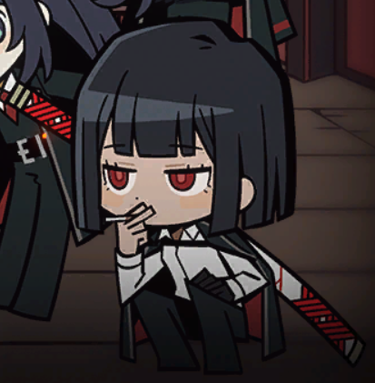

# AutoBus v1.0.0
AutoBus is a high-performance, image-recognition-based automation script designed for **Limbus Company**. 
Built with Python, OpenCV, and Streamlit, it automates "Mirror Dungeon" loops using a sophisticated state-machine and modular task dispatching.

## Key Features

* **Intelligent State Detection**: Uses template matching with optimized bounding boxes (BBox) to minimize CPU usage.
* **Modular Task System**: Dedicated controllers for Battle, Event handling, Shopping, Navigation, Identity selection, etc...
* **Advanced Event Handling**: 
    * **Primary Logic**: Uses a hard-coded decision matrix to select optimal event choice to ensure efficiency
    * **Hard-coded Failsafe**: Includes an `event_failsafe` module that triggers if an unknown/newly updated/rare event occurs, ensuring the bot safely exits the event without getting stuck.
* **Road Navigation Strategy**:
    * **Priority Mode**: Scans the map and navigate toward the least time-consuming nodes if possible.
    * **Fallback Mode**: A "fail-safe" pathfinding logic using offsets that ensures the bot reaches navigation even if specific nodes are undetected.
* **Streamlit Dashboard**: A modern web-based UI to manage team queues, user preferences, live logs and automation.

## Project Architecture

AutoBus follows a decoupled architecture to ensure high performance and modularity:

### 1. Two Flow Managers
* **DungeonEntryManager**: Handles the "Road to Dungeon" (Home -> Team Select -> Star Buff Select -> Start Gift Select).
* **DungeonRunManager**: Manages the "In-Dungeon" logic (Theme-pack -> Map -> Battle/Event -> Shop -> Boss along with Reward Select, Identity Select, Gift Select, Result Claim).

### 2. Vision Engine
The Vision module provides real-time environmental awareness through a multi-modal recognition pipeline:
* **Adaptive Normalization (CLAHE)**: Processes images with **Contrast Limited Adaptive Histogram Equalization**, making the bot resistant to screen flashes, particle effects, and lighting changes.
* **Standard Template Matching (`TM_CCOEFF_NORMED`)**: Rapidly locates UI anchors using a three-tier search model (**Focused**, **Relaxed**, and **Global**) to minimize scan areas.
* **Feature Matching (ORB & FLANN)**: Identifies complex or scaling objects (like E.G.O. Gifts).

### 3. Controller System
The Controller impersonate user's input:
* **Win32 API Interaction**: Directly communicates with the game's Window Handle (`hwnd`) to ensure inputs are sent to the correct process.
* **Input Simulation**: Uses `PyAutoGUI` for low-level mouse movements and clicks.
* **Environment Validation**: Automatically verifies if the game window is active, correctly resized (1920x1080), and not minimized before executing commands.

## Considerations

* It is recommended to run at resolutions of 1920 * 1080, and set the game window as 'Windowed'
* Please set Texture Quality and Render Scale to High in Settings-Graphics, set both Normal FPS and Combat FPS to 60, and set Post-Processing to Off. Otherwise, software recognition may encounter difficulties

## Getting Started

### Prerequisites
* **Python**: v3.12 or higher.
* **OS**: Windows 10/11.

### Installation
1. Clone the repository:
    ```bash
    git clone [https://github.com/DTMplz1196/AutoBus.git](https://github.com/DTMplz1196/AutoBus.git)
    cd AutoBus
    ```

2. Synchronize the environment using the lockfile:
    ```bash
    uv sync
    ```

### Execution
To start the graphical interface, run the following command from the project root:
```powershell
    uv run streamlit run module/ui/gui.py
```


## Acknowledgements

The development of AutoBus was made possible by the inspiration and technical foundations of the following open-source projects:

* **[AhabAssistantLimbusCompany (AALC)](https://github.com/KIYI671/AhabAssistantLimbusCompany)**: A core inspiration for this project's logic. Studying its architecture provided the initial roadmap for automating Mirror Dungeon flows.

## Future Plans
* **Enkephalin Module**: Automated conversion of excess Enkephalin into Modules to ensure no stamina waste.
* **Luxcavation Automation**: Automation of daily **EXP** and **Thread** Luxcavations.
* **Daily Missions**: Automated tracking and claiming of the Battle Pass daily objectives.
* **Skill 3 Prioritization**: Identify and use Skill 3 in focused encounters.
* **EGO**: Automates and use EGO during battle.
* **Enhanced Shopping**: Automates enhancing and fusing EGO gifts, add a sub gift type when primary gift type is fully acquired.
* **Better UI**: Develop more complex front end for better UI

## License & Disclaimer
* License: Distributed under the AGPL-3.0 License.
* Disclaimer: AutoBus is an educational project developed for a thesis. It is not affiliated with Project Moon. Use of automation tools may violate the game's Terms of Service. Use at your own risk.

## Authors
* DTMplz1196